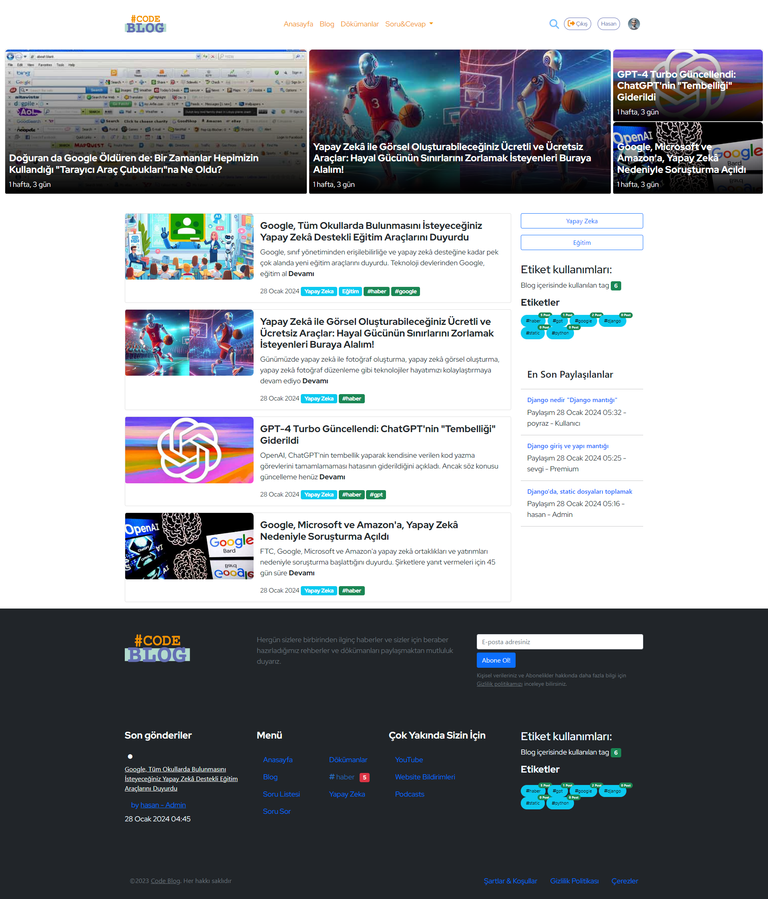
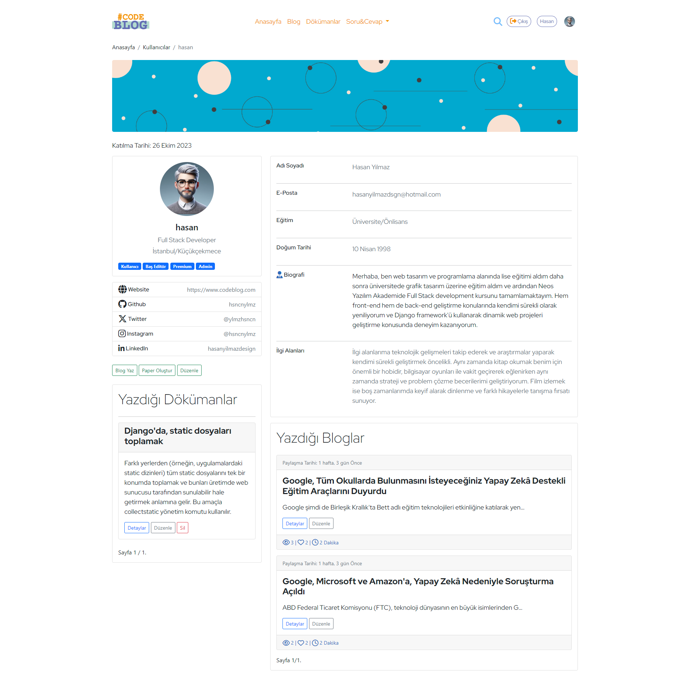
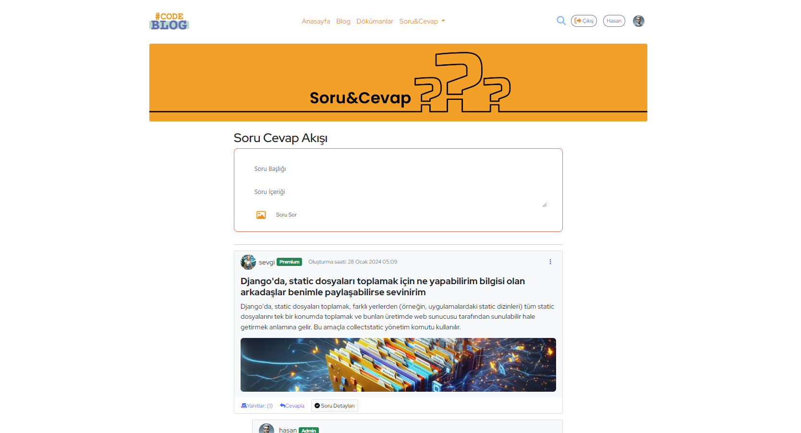

# Blog ve Döküman Yayınlama Platformu

@hsncnylmz :+1: Sizin için özel olarak hazırladığım bu dökümanı sonuna kadar incelemenizi tavsiye ediyorum :four_leaf_clover:	

## Proje Tanımı

Projemiz, kullanıcıların blog ve dökümanlarını oluşturmasına, düzenlemesine, yayınlamasına ve birbirleriyle etkileşimde bulunmasına olanak tanıyan geniş kapsamlı bir içerik yönetim sistemidir.

## Ana Özellikler


### Blog Yönetimi

- **Kullanıcı Dostu Blog Oluşturma:** Başlık, görsel, açıklama ve içerik ekleyerek kullanıcılar kendi bloglarını oluşturabilirler.
- **Kategorilendirme ve Etiketleme:** Bloglar kategorilere ayrılabilir ve etiketlerle işaretlenebilir, bu sayede içerikler kolayca filtrelenebilir.
- **Etkileşim:** Kullanıcılar, beğeni ve yorumlar ekleyerek bloglara katkıda bulunabilirler.

**Örnek bir blog detay sayfası:** [Blog Detay Sayfası](https://blogcode.azurewebsites.net/blogs/doguran-da-google-olduren-de-bir-zamanlar-hepimizin-kullandg-tarayc-arac-cubuklarna-ne-oldu)

### Döküman Yönetimi

- **Zengin Metin Formatları:** Döküman içerikleri CKEditor ile zengin metin formatlarında oluşturulabilir.
- **Kategori ve Etiketleme:** Dökümanlar da kategorilere ve etiketlere ayrılabilir, bu da içerikleri daha iyi organize etmeyi sağlar.


### Kullanıcı Profil Yönetimi

- **Kişiselleştirilmiş Profiller:** Kullanıcılar, profil fotoğrafı, kapak fotoğrafı, biyografi gibi bilgiler ekleyerek kendi profillerini oluşturabilir ve düzenleyebilirler.
- **Sosyal Medya Entegrasyonu:** Kullanıcılar sosyal medya hesaplarını ve kişisel bilgilerini düzenleyebilirler.

**Örnek bir profil sayfası:** [Profil Sayfası](https://blogcode.azurewebsites.net/account/profile/hasan/)


### Yorum ve Reaksiyon Sistemi

- **Etkileşim:** Kullanıcılar, bloglara ve dökümanlara yorum yapabilir, beğeni ve farklı reaksiyonlar ekleyebilirler.
- **AJAX İle Anında Geri Bildirim:** AJAX kullanılarak sayfa yenilenmeden like-dislike ve reaksiyon butonları ile etkileşim sağlanmıştır.


### Yetkilendirme ve Rollendirme

- **Farklı Rollere Göre Erişim Kontrolü:** Admin paneli üzerinden farklı rollerde kullanıcıların erişim kontrolü yapılabilmektedir.

### Premium Üyelik Sistemi

- **Avantajlar ve Özel İçerikler:** İsteğe bağlı olarak eklenen premium üyelik sistemi ile kullanıcılara özel içerik veya avantajlar tanımlanabilir.

## Teknolojiler

- **Django Web Framework:** Proje, güçlü ve hızlı bir şekilde geliştirme yapmak için Django kullanılarak oluşturulmuştur.
- **CKEditor:** Zengin metin formatlı içerik oluşturmak için CKEditor entegre edilmiştir.

## Dizin Yapısı

- **accountuser:** Kullanıcı yönetimi ve kullanıcı profili modellerini içerir.
- **blogapp:** Blog ve döküman modellerini, yorumlar ve reaksiyonlar gibi uygulama özelliklerini içerir.
- **paper:** Kullanıcıların ücretli veya ücretsiz olarak dökümanlarını paylaşabileceği bölümü içerir.
- **community:** Kullanıcıların birbirine soru sorduğu ve cevap verdiği bir topluluk bölümünü içerir.
- **payment_app:** Ödeme sistemi için kullanılan modelleri içerir.

## Kullanıcı Dostu Arayüz ve Detaylar

- **Bootstrap Kullanımı:** Proje, Bootstrap card yapısı ile kullanıcı dostu bir arayüz sunar.
- **Form Kontrol Inputları:** Kullanıcıların kolayca bilgi girebilmesi için Bootstrap form kontrol inputları kullanılmıştır.
- **Buton ve Görsel Yapılar:** Bootstrap butonları ve görsel kenar yumuşatmalar, estetik bir görünüm sağlamak için kullanılmıştır.

## Ek Özellikler

- **AJAX ve Anında Etkileşim:** Sayfa yenilenmeden kullanıcıların reaksiyon göstermesini sağlamak amacıyla AJAX kullanılmıştır.
- **Community Uygulaması:** Kayıt olmadan yorum yapma sistemi ve random avatar atanma özelliği, topluluk etkileşimini artırır.
- **Başlık Listeleme ve Gezinme:** jQuery ile başlıkların otomatik olarak yakalanıp, sağ tarafta listelenmesi kullanıcıların içeriklere daha hızlı erişimini sağlar.

## Sonuç

Bu proje, kullanıcıların içerik oluşturmasına, paylaşmasına ve etkileşimde bulunmasına olanak tanıyan kapsamlı bir içerik yönetim sistemidir. Kullanıcı dostu arayüzü, özel özellikleri ve topluluk oluşturmayı hedefleyen yapısıyla dikkat çeker. Her bir kullanıcı kendi profil sayfasını özelleştirebilir ve arama butonu ile istedikleri içeriklere hızlıca ulaşabilirler.

# Django Paketleri ve İşlevleri

Bu repository, Django web framework'ü üzerinde çalışırken kullanılabilecek bazı popüler Python paketlerini içerir.

## Django

Django, Python tabanlı bir web framework'üdür. Veritabanı yönetimi, URL yönlendirmeleri, şablona dayalı görünüm sistemleri gibi birçok özellik içerir. Web uygulamalarını hızlı bir şekilde geliştirmek için kullanılır.

```bash
pip install Django 
```

## Asgiref

Django 3.0 ve sonraki sürümler, Asynchronous Server Gateway Interface (ASGI) sunucu desteği sağlar. Bu kütüphane, ASGI uyumlu uygulamalar ve sunucular arasında iletişimi kolaylaştırmak için kullanılır.

```bash
pip install asgiref
```

## django-ckeditor

Django için zengin metin düzenleyici sağlayan bir uygulama. Kullanıcılara daha fazla metin düzenleme yeteneği eklemek için kullanılabilir.

```bash
pip install django-ckeditor
```

## django-js-asset

Django'nun statik dosya yönetimini geliştirmek için kullanılır. JavaScript dosyalarınızı yönetmek ve optimize etmek için kullanışlıdır.

```bash
pip install django-js-asset
```

## Pillow

Python Imaging Library'nin (PIL) devamıdır ve resim işleme işlevselliği sağlar. Django'nun ImageField'ı gibi bazı modüller için gereklidir.

```bash
pip install Pillow
```

## sqlparse

SQL sorgularını analiz etmek, biçimlendirmek ve güzelce görüntülemek için kullanılır. Django'nun geliştirme ortamında SQL sorgularını daha iyi anlamak için kullanışlıdır.

```bash
pip install sqlparse
```

## tzdata

Django'nun zaman dilimi (timezone) desteği için kullanılır. Belirli bir tarih veritabanı sürümünü belirtir ve zaman dilimi bilgilerini içerir.

```bash
pip install tzdata
```

> [!NOTE]
> Bu paketler, genellikle Django projelerinizde farklı özellikleri eklemek veya geliştirmek için kullanılır. Örneğin, zengin metin düzenleme, resim işleme, statik dosya yönetimi gibi alanlarda Django'nun yeteneklerini artırmak için kullanışlıdırlar.


> [!TIP]
> # Nasıl Kullanılır
> Proje klonlandıktan sonra, sanal bir ortam oluşturun ve bağımlılıkları yükleyin:

```bash
python -m venv venv
source venv/bin/activate
pip install -r requirements.txt
```

Django uygulamasını başlatın:

```bash
python manage.py migrate
python manage.py runserver
```

Uygulama http://localhost:8000/ adresinde çalışacak şekilde ayarlanmıştır. Tarayıcınızda bu adresi açarak uygulamayı görebilirsiniz.
